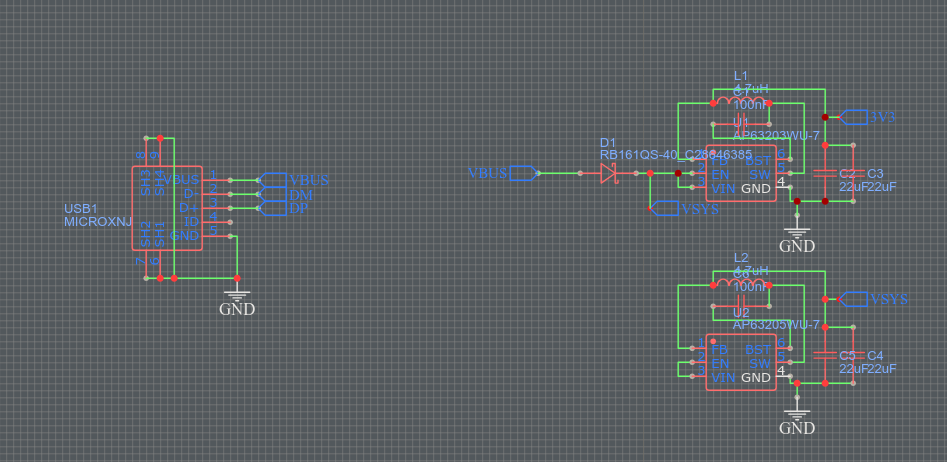
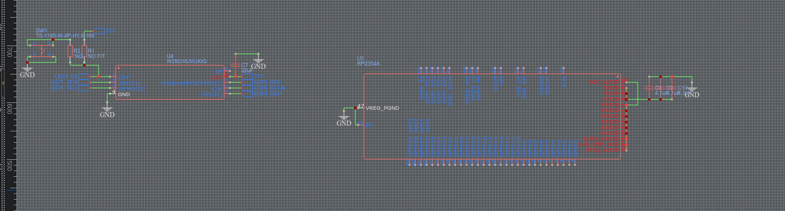
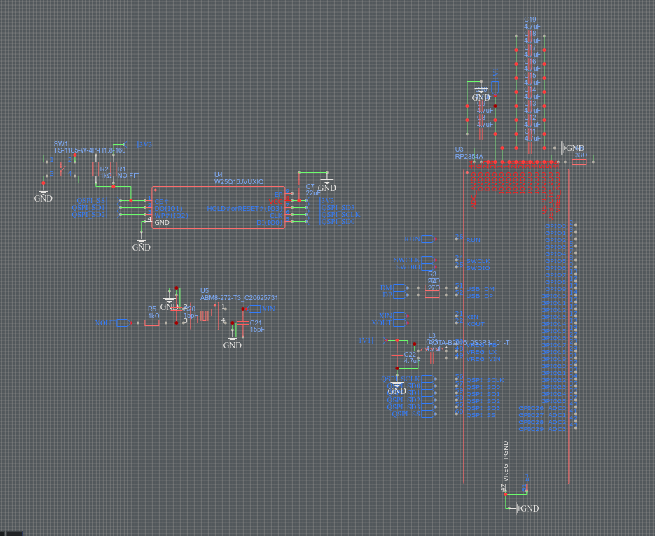

# Oct 21st: Basic USB and Power supply

The board design started with simple and must have things. I've created a micro usb connector, 5V and 3.3V power unit to power all electronics. No pcb save file yet

**Total time spent: 2h**

# Oct 27th: 

Few changes:
- Added label for Voltage in
- Added flash chip
- Added rp2354b

it took a longer time than nomrally because of reading documentation of rp2345b

**Total time spent: 3h**

# Oct 28th: 

I have added crystal oscillator, decoupling capacitors and the core power supply components. Also changed the layout of the mcu

**Total time spent: 3h**